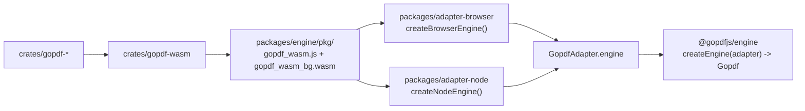
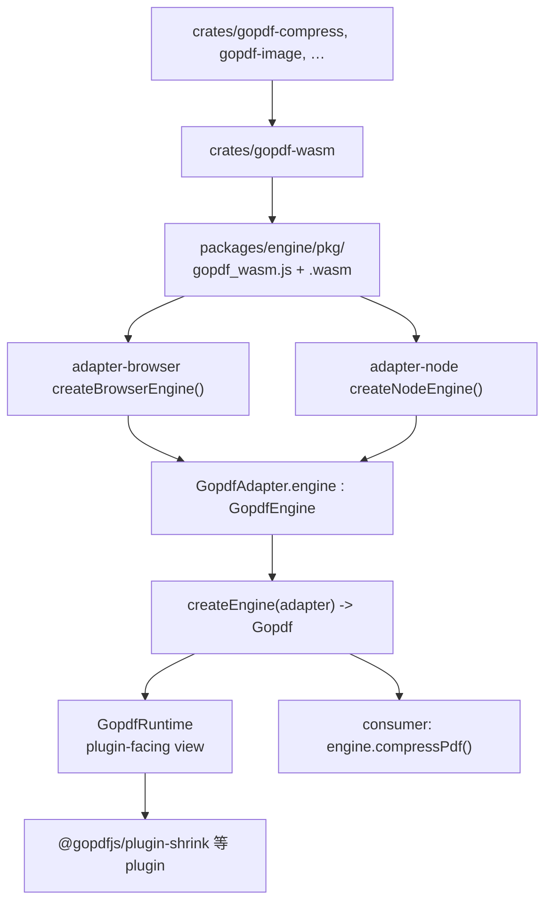

# RFC 0057 - Rust/WASM Engine Architecture & `GopdfEngine`

- **Status**: Accepted (revised 2026-07-08 — plugin acceleration backend via adapters)
- **Author**: Antigravity (revised for `@gopdfjs` engine + adapter model)
- **Date**: 2026-03-21

## 1. Objective

定义 GoPDF 中 **Rust → WebAssembly → `GopdfEngine` port** 的构建、加载与 adapter 集成。

这里的 WASM 不是 consumer-facing API，也不是顶层产品边界；它只是 **engine plugins 可选使用的 acceleration backend**。

**库边界与消费方式**见 **RFC 0058**（engine + adapter charter）。

**核心变更（2026-07-08）：**

- WASM **不再**作为 `@gopdfjs/engine` 顶层 `compressPdf()` 导出给消费者
- WASM 由 **`@gopdfjs/adapter-browser` / `@gopdfjs/adapter-node`** 实现 `GopdfEngine` port，供 plugins 使用
- 消费者 **只** 调用 `createEngine(adapter)` → feature APIs；不接触 WASM primitives

## 2. Why Rust/WASM (and When Not To)

### When WASM wins

大字节缓冲的 Flate 重压缩、批量图像编码、流级变换 — Rust 在线性内存上更可预测。

### When to stay with JavaScript

I/O、交互、pdf-lib 结构编辑、SubtleCrypto 加密 — 保留 JS（见 §6 矩阵）。

### SubtleCrypto exception

`protectPdf` / `unlockPdf` 用 **SubtleCrypto**（硬件加速），不用 WASM 重造 AES。

## 3. Package structure（engine + adapter）

| 组件 | 路径 | 发布 |
|------|------|------|
| Rust 算法 | `crates/gopdf-compress`, `gopdf-image`, `gopdf-linearize`, … | 否 |
| WASM 绑定 | `crates/gopdf-wasm` → wasm-pack → `packages/engine/pkg/` | 随 `@gopdfjs/engine` 分发；**adapter-only 子路径，非 consumer API** |
| 契约 | `packages/ports` — `GopdfEngine`, `GopdfAdapter`, … | 是 |
| 门面 | `packages/engine` — `createEngine` only | 是 |
| Browser adapter | `packages/adapter-browser` — browser env work only: `GopdfEngine` + `PdfJsRuntime` + canvas | 是 |
| Node adapter | `packages/adapter-node` — Node env work only: `GopdfEngine` + `PdfJsRuntime` + canvas + OCR | 是 |
| 插件域 | `packages/struct`, `shrink`, `grayscale`, … | 是（engine 内部） |
| CLI | **separate `gopdf-cli` repo** | 独立发布 |



**禁止：** 宿主 / 产品 / plugin 直接 `import { compress_pdf } from "@gopdfjs/engine/pkg/…"`。只有 **adapter** 可加载 `pkg/`；feature 经 `GopdfEngine` port 或 `engine.*()` 消费。

### 3.1 How WASM works（端到端）

| 步 | 谁 | 干什么 |
|----|-----|--------|
| 1 | `crates/gopdf-*` | Rust 算法 |
| 2 | `crates/gopdf-wasm` | wasm-bindgen 导出 `compress_pdf` 等符号 |
| 3 | `pnpm build:wasm` | wasm-pack → `packages/engine/pkg/gopdf_wasm.js` + `gopdf_wasm_bg.wasm`（gitignore） |
| 4 | `adapter-browser` / `adapter-node` | `import "@gopdfjs/engine/pkg/gopdf_wasm.js"` → `init()` / `initSync()` → 实现 `GopdfEngine` |
| 5 | `createEngine(adapter)` | adapter 包装为 `GopdfRuntime`（RFC 0058 §2.3.3）；`ownPdfBytes` 后调 port |
| 6 | plugin（如 `@gopdfjs/plugin-shrink`） | 收 domain args + `GopdfRuntime`；可选调 `runtime.engine.compressPdf` — **不接触 adapter** |
| 7 | consumer | **只** `engine.compressPdf(bytes, level)` — 不碰 `pkg/`、不碰 `compress_pdf` |



### 3.2 Repository roles

| 路径 | 用途 |
|------|------|
| `crates/` | Rust；`pnpm build:wasm` |
| `packages/ports` | 零 env 契约 |
| `packages/engine` | 门面 wire；**无** env 依赖 |
| `packages/adapter-*` | 唯一 WASM/pdf.js/canvas/OCR 加载点 |
| `demos/react/` | 浏览器 acceptance + Playwright |
| `site/` | 文档 |

## 4. Build pipeline

### 4.1 Prerequisites

```bash
rustup target add wasm32-unknown-unknown
# wasm-pack: https://rustwasm.github.io/wasm-pack/installer/
```

### 4.2 Build（仓库根目录）

```bash
pnpm build:wasm
# wasm-pack build crates/gopdf-wasm --target web --out-dir ../../packages/engine/pkg --release
```

`--target web` → ES module，供 adapter `import`。

### 4.3 Vite 宿主（`demos/react/`）

- `vite-plugin-wasm` + `vite-plugin-top-level-await`
- `optimizeDeps.exclude: ["@gopdfjs/engine"]`
- `server.fs.allow` 含 monorepo 根（读 `pkg/*.wasm`）
- 见 `demos/react/vite.config.ts`

**外部消费者同样适用：** bundle `@gopdfjs/adapter-browser` 的宿主（Vite/webpack）需等效配置（wasm asset 处理 + top-level await）；发布前须在 README / PUBLISHING.md 提供该指引。

### 4.4 `@gopdfjs/engine` exports

```json
{
  "name": "@gopdfjs/engine",
  "exports": {
    ".": "./src/index.ts",
    "./compare": "./src/compare.ts",
    "./render": "./src/renderPage.ts",
    "./pkg/*": "./pkg/*"
  }
}
```

| 子路径 | 谁可用 | 说明 |
|--------|--------|------|
| `.` | consumer | `createEngine`、类型 re-export；**无**顶层 `compressPdf` |
| `./compare` · `./render` | consumer（专用） | 双文档 compare、低层 render helper |
| `./pkg/*` | **adapter only** | wasm-pack 产物；adapter 实现 `GopdfEngine`；**宿主禁止 import** |

## 5. WASM integration（adapter 加载）

### 5.1 `GopdfEngine` port（RFC 0058 §2.3.3）

契约：`packages/ports/src/engine.ts`

```ts
interface GopdfEngine {
  compressPdf(bytes, level, onProgress?): Promise<Uint8Array>;
  encodeImages(pixelsFlat, widths, heights, format, quality?): Promise<Uint8Array>;
  grayscalePdf(bytes): Promise<Uint8Array>;
  linearizePdf(bytes): Promise<Uint8Array>;
}
```

`GopdfEngine` 是 **engine-internal acceleration contract**。它服务 plugin orchestration，不是默认 consumer API。

### 5.2 Adapter 实现

**Browser** (`adapter-browser/src/engine.ts`):

```ts
import {
  compress_pdf,
  encode_images,
  grayscale_pdf,
  linearize_pdf,
} from "@gopdfjs/engine/pkg/gopdf_wasm.js";

const initWasm = (await import("@gopdfjs/engine/pkg/gopdf_wasm.js")).default;
await initWasm();

return {
  compressPdf: (b, l, p) => compress_pdf(b, l, p, p ? (x) => p(x) : undefined),
  encodeImages: (…) => encode_images(…),
  grayscalePdf: (b) => grayscale_pdf(b),
  linearizePdf: (b) => linearize_pdf(b),
};
```

**Node** (`adapter-node/src/engine.ts`):

```ts
const wasmJs = require.resolve("@gopdfjs/engine/pkg/gopdf_wasm.js");
const wasmBg = require.resolve("@gopdfjs/engine/pkg/gopdf_wasm_bg.wasm");
const { initSync, compress_pdf, … } = await import(wasmJs);
initSync({ module: new Uint8Array(fs.readFileSync(wasmBg)) });
```

### 5.3 Rust / WASM 符号表

| WASM export | `GopdfEngine` | RFC | 状态 |
|-------------|---------------|-----|------|
| `compress_pdf` | plugin `compressPdf` path | 0008 | **Done** P1 |
| `encode_images` | image/pdf render plugins | 0017/0018 | **Done** |
| `grayscale_pdf` | plugin `grayscalePdf` path | 0028 | **Partial** stub |
| `linearize_pdf` | plugin `linearizePdf` path | 0042 | **Partial** stub |

源码：`crates/gopdf-wasm/src/lib.rs` + 各 `crates/gopdf-*/src/lib.rs`。

### 5.4 Worker（历史 / 可选）

早期设计用 dedicated `worker.ts` + `postMessage` 协议。当前 adapter **主线程/Node 直接** wasm-bindgen。

若未来为浏览器主线程隔离 reintroduce Worker：

- Worker 仅实现 `GopdfEngine` 四方法
- 协议：`{ id, op, payload }` + `transfer`（见旧 §5.1 草案）
- **对外 API 不变** — 仍经 `createEngine(adapter)`

### 5.5 消费者示例（唯一正确路径）

```ts
import { createBrowserGopdf } from "@gopdfjs/adapter-browser";

const engine = await createBrowserGopdf();
const bytes = new Uint8Array(await file.arrayBuffer());

const out = await engine.compressPdf(bytes, "recommended", (f) => {
  console.log(Math.round(f * 100), "%");
});

// `encodeImages` stays below the consumer feature layer.
```

```ts
import { createNodeGopdf } from "@gopdfjs/adapter-node";

const engine = await createNodeGopdf();
const out = await engine.linearizePdf(bytes);
```

## 6. Tool decision matrix

| RFC | Tool | WASM / JS | consumer-facing API | internal accelerator |
|-----|------|-----------|---------------------|----------------------|
| 0008 | Compress | **WASM** | `compressPdf` | `compressPdf` |
| 0017 | JPG→PDF | **Hybrid** | `jpgToPdf` | `encodeImages` |
| 0018 | PDF→JPG | **Hybrid** | `pdfToJpeg` | `encodeImages` |
| 0028 | Grayscale | **WASM** stub | `grayscalePdf` | `grayscalePdf` |
| 0042 | Linearize | **WASM** stub | `linearizePdf` | `linearizePdf` |
| 0006–0016 | Struct edits | **JS** pdf-lib | `mergePdfs`, `splitPdf`, … | — |
| 0019 | PDF→Word | **JS** (+ future WASM) | `pdfToWord` | optional future backend |
| 0020 | OCR | **JS** tesseract | `ocr` (Node) | — |
| 0021/0022 | Protect/Unlock | **JS** crypto | `protectPdf` / `unlockPdf` | — |
| 0026 | Redact | **JS** + raster | `redactPdf` | — |
| 0027 | Repair | **JS** | `repairPdf` | — |
| 0061 | Analyze | **JS** (+ future WASM) | `analyzePdf` | optional future backend |

矩阵修订须同步 RFC 0058 §2.6 与 `createEngine.ts`。

## 7. Progress reporting

`compressPdf` / 长任务：`GopdfEngine.compressPdf` 的 `onProgress(fraction)`；门面透传 `engine.compressPdf(bytes, level, onProgress)`。

## 8. Testing strategy

### 8.1 Rust

```bash
pnpm test:rust   # cargo test --workspace
```

### 8.2 Unit — adapters + engine + ports

| 包 | 必测项 |
|----|--------|
| `ports` | `clonePdfBytes` · async contract |
| `engine` | `createEngine` routing · **facade bytes pressure（全部方法；ownership 主责）** · integration chain |
| `adapter-node` | env-port 单测：pdfjs · canvas · OCR · WASM 四 op（full coverage 未完成） |
| `adapter-browser` | env-port 单测：pdfjs · canvas · WASM init（发布仍看真实浏览器 e2e） |
| `shrink` | compress ownership（双 loadDocument） |
| 工具域 | 各包现有 Vitest |

### 8.3 Browser e2e（真实 Chromium）

```bash
pnpm test:e2e
```

| 文件 | 覆盖 |
|------|------|
| `demos/react/e2e/tools/all-tools.spec.ts` | 31 generic `Gopdf` 路由 |
| `compress.spec.ts` | RFC 0008 |
| `engine-smoke.spec.ts` | bytes 链式压力 |

**规则：** 新 `Gopdf` 方法 → `demos/react` 路由 + `toolIds.ts` + e2e 矩阵行。

### 8.4 Node integration（发布前 P0）

`packages/engine/src/__tests__/integrationBytesChain.test.ts` 模式扩展到 **每个** `Gopdf` 方法（`createNodeGopdf` + fixture）。

## 9. Success criteria

- [x] `pnpm build:wasm` → `packages/engine/pkg/gopdf_wasm.js` + `gopdf_wasm_bg.wasm`
- [x] `GopdfEngine` 由 browser + node adapter 实现
- [x] `createEngine` 为唯一 WASM 工具消费路径
- [x] Facade byte ownership 测试
- [ ] Node adapter full port 单测
- [ ] Browser e2e 全工具全绿
- [ ] 10 MB 级 PDF 稳定（按工具抽测）
- [ ] `gopdf_wasm_bg.wasm` gzip < 1 MB
- [ ] PDF Object Layer → 解锁 0008 P2 / 真实 0028·0042

## 10. Related

- **RFC 0058** — engine + adapter charter、§2.6 方法表、发布门禁
- **RFC 0008** — compress P1
- Skill **`gopdf-e2e`** · **`gopdf-browser-pdf-wasm`**
