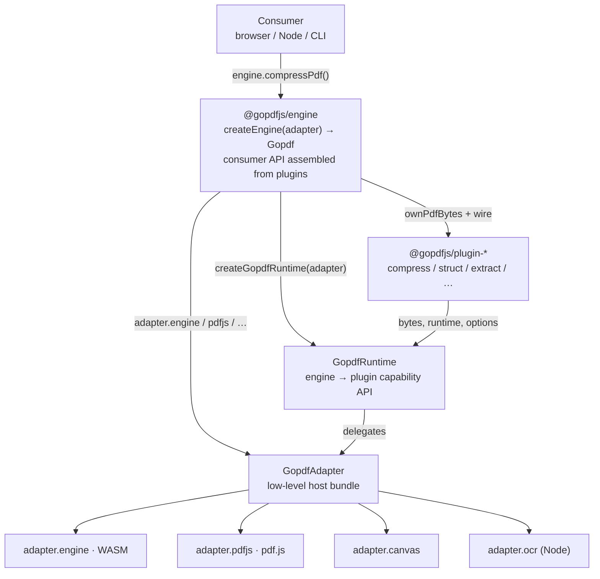

# RFC 0058 - Engine Plugin Charter（PDF capability layering）

- **Status**: Accepted (revised 2026-07-11 — WASM per adapter; engine `.` only)
- **Author**: GoPDF maintainers
- **Date**: 2026-03-22

## 1. Objective

**Every tool RFC exists to specify shippable `@gopdfjs/*` npm packages.**

**Publish rule (non-negotiable):** every PDF capability exposed to consumers **must** be callable on a `Gopdf` instance from `createEngine(adapter)`. No parallel public API on plugin packages, no env imports in product code, no bypassing the facade.

**Plugin rule:** each feature is a **plugin** (`@gopdfjs/plugin-*`). Engine **assembles** the consumer `Gopdf` API from plugin implementations. Engine **builds** `GopdfRuntime` from `GopdfAdapter` and **passes runtime into plugins** — plugins never see the adapter.

| 层 | 包 | 谁消费 | 职责（一句话） |
|----|-----|--------|----------------|
| **Consumer API** | `@gopdfjs/engine` | 产品 / demo / CLI | `createEngine(adapter)` → `Gopdf`；`engine.*()` 是唯一对外 API |
| **Runtime** | `@gopdfjs/runtime` | `plugin-*` | Engine 暴露给插件的能力面；由 engine 从 adapter 构造 |
| **Adapter** | `@gopdfjs/adapter` + `adapter-browser` / `adapter-node` | **仅 engine** | 宿主底层实现（WASM · pdf.js · canvas · OCR） |
| **Plugin impl** | `@gopdfjs/plugin-shrink` 等 | **仅 engine**（内部 wire） | 功能逻辑；签名收 `GopdfRuntime`，不收 `GopdfAdapter` |
| **Plugin 契约** | `@gopdfjs/plugin` | `plugin-*` | domain options/results |
| **Shared model** | `@gopdfjs/model` | adapter ports · runtime · plugins | `PdfDocument` · `CanvasSurface` 等共享形状 |

| 层 | 包 | 消费者可 import？ |
|----|-----|------------------|
| **门面** | `@gopdfjs/engine` | **是** — `createEngine` + `Gopdf` 类型 |
| **环境** | `@gopdfjs/adapter-browser` · `@gopdfjs/adapter-node` | 宿主初始化 adapter 一次 |
| **Adapter / runtime / plugin 契约** | `@gopdfjs/adapter` · `@gopdfjs/runtime` · `@gopdfjs/plugin` · `@gopdfjs/model` | 类型作者 / plugin 作者；**产品 UI 不要** |
| **插件实现** | `@gopdfjs/plugin-*` | **否** |

本 RFC 与 **RFC 0057** 配套：0057 = Rust/WASM acceleration backend 构建与 adapter load/init；本 RFC = **plugin/engine 边界**、adapter 模型、验收与发布。

**Non-goals:** product websites, React shells, i18n — `apps/site/` is OSS docs only; npm consumers only.

## 2. Library identity

| 项 | 约定 |
|----|------|
| npm scope | **`@gopdfjs/*`** — 全部在 `packages/` |
| 数据契约 | **`Uint8Array` in/out**；宿主读 `File` / `fs` 一次 |
| 唯一门面 | **`createEngine(adapter)` → `Gopdf`** |
| Core npm | **`@gopdfjs/engine`** — wire 全部 feature plugins 到 `Gopdf` |
| 契约 npm | **`@gopdfjs/adapter`** — adapter ports · **`@gopdfjs/runtime`** — `GopdfRuntime` · **`@gopdfjs/plugin`** — domain 类型 |
| Browser adapter | **`@gopdfjs/adapter-browser`** — browser env：`GopdfEngine`（wasm-pack `web` → `pkg/`）+ pdf.js + canvas |
| Node adapter | **`@gopdfjs/adapter-node`** — Node env：`GopdfEngine`（wasm-pack `nodejs` → `pkg/`）+ pdf.js + canvas + OCR |
| Node CLI | **separate `gopdf-cli` repo** — 薄包装 `createNodeGopdf()`；不在本 monorepo |
| Rust / WASM | `crates/gopdf-*` → **`@gopdfjs/wasm`**（`rust/` bindgen + `pkg/`） | 算法 workspace；WASM 单一 npm 包；adapter 负责 load |

### 2.1 Monorepo layout

| 路径 | 职责 | npm 发布 |
|------|------|----------|
| **`crates/`** | Rust 算法 | 否 |
| **`packages/model`** | 共享 document/canvas 类型 | 是 |
| **`packages/adapter`** | adapter 契约（零 env 依赖） | 是 |
| **`packages/runtime`** | runtime 契约（`GopdfRuntime` + document） | 是 |
| **`packages/plugin`** | plugin domain 契约 | 是 |
| **`packages/engine`** | `createEngine` 门面 | 是 |
| **`packages/adapter-browser`** · **`adapter-node`** | 环境端口 + **own** wasm-pack `pkg/` | 是 |
| **`packages/plugin-{struct,shrink,…}`** | feature plugin 逻辑（import `@gopdfjs/runtime` + `@gopdfjs/plugin`） | 是（实现单元；**不作为 consumer facade**） |
| **`packages/fixtures`** | 测试 fixture（dev only） | 否 |
| **`apps/demo/`** | 浏览器 acceptance + Playwright e2e | 否 |
| **`apps/site/`** | OSS 文档 | 否 |

### 2.2 Delivery model

| 消费方式 | 入口 | 浏览器 |
|----------|------|--------|
| **Browser app** | `createBrowserGopdf()` 或 `createEngine(await createBrowserAdapter())` | 要 |
| **Node script** | `createNodeGopdf()` 或 `createEngine(await createNodeAdapter())` | 不要 |
| **Terminal** | **`gopdf-cli <cmd>`**（独立仓） | 不要 |
| **AI agent (MCP)** | **`gopdf-cli`** — `gopdf mcp`（stdio server）+ `gopdf install cursor|claude|…`（agent config）；tool 面 = §2.6 方法表 | 不要 |
| **Product (ilovepdf)** | `import` from `@gopdfjs/engine` + adapter | 按路由 |

每个 numbered tool RFC（0006+）必须声明：**`Gopdf` 方法名**、**依赖包**、**浏览器 e2e**、**Node 验收**。

发布步骤：[`docs/PUBLISHING.md`](../../docs/PUBLISHING.md)。

## 2.3 Engine + plugin + adapter architecture（权威）

### 2.3.0 四个角色（必读）

| 角色 | 包 | 创建者 | 消费者 | 做什么 |
|------|-----|--------|--------|--------|
| **Engine** | `@gopdfjs/engine` | `createEngine(adapter)` | **宿主 / 产品** | 对外暴露 `Gopdf` API（`engine.compressPdf()` …） |
| **Runtime** | `@gopdfjs/runtime` | **engine**（`createGopdfRuntime(adapter)`） | **`plugin-*`** | engine 给插件用的能力面；插件只收 `GopdfRuntime` |
| **Adapter** | `@gopdfjs/adapter` + `adapter-*` | **宿主**（`createBrowserAdapter()`） | **仅 engine** | 底层宿主实现：WASM · pdf.js · canvas · OCR |
| **Plugin** | `@gopdfjs/plugin-*` | 各 feature 包 | **仅 engine**（内部调用） | 实现功能；engine 把插件方法挂到 `Gopdf` 上发布 |

**数据流（单向）：**

```
宿主 bytes
  → engine.*()          ← consumer API（由 engine 基于 plugin 组装）
       → plugin-*(bytes, runtime, …)
            → runtime.*()     ← engine 从 adapter 构造，注入插件
                 → adapter.*() ← 仅 engine 持有；插件不可见
```

**Engine 组装 consumer API：** `createEngine.ts` import 各 `@gopdfjs/plugin-*` 函数，包一层 `ownPdfBytes()`，挂到 `Gopdf` 实例。§2.6 方法表 = 对外 API；实现 = plugin。

### 2.3.1 分层图



### 2.3.2 包职责（硬边界）

| 包 | import 规则 | 职责 |
|----|-------------|------|
| `@gopdfjs/engine` | **产品 / demo / CLI** | 唯一 consumer 入口；`createEngine(adapter)`；从 `plugin-*` 组装 `Gopdf`；`createGopdfRuntime(adapter)` 注入插件 |
| `@gopdfjs/adapter` | **adapter 作者 + engine** | `GopdfAdapter` 契约；底层 port 类型；**不给 plugin** |
| `@gopdfjs/adapter-browser` · `adapter-node` | 宿主 | 实现 `GopdfAdapter`（WASM · pdf.js · canvas · OCR） |
| `@gopdfjs/runtime` | **`plugin-*` only** | `GopdfRuntime` — engine 暴露给插件的 API |
| `@gopdfjs/plugin` | **`plugin-*`** | domain options/results |
| `@gopdfjs/model` | adapter · runtime · plugins | 共享 `PdfDocument` / `CanvasSurface` |
| `@gopdfjs/plugin-*` | **禁止产品 import** | 功能实现；`(bytes, runtime, …)`；由 engine wire 到 `Gopdf` |

**禁止：**

- 产品 / demo / CLI 直接 `import { mergePdfs } from "@gopdfjs/plugin-struct"`
- `plugin-*` import `@gopdfjs/engine` 或 `@gopdfjs/adapter-*`
- plugin 签名收 `GopdfAdapter` — 只能收 `GopdfRuntime`
- adapter 依赖 runtime（adapter 不知 runtime；runtime 契约在 `@gopdfjs/runtime`，构造在 engine）
- demo 暴露底层库名；UI 只写 `engine.*()` / `createBrowserGopdf()`
- consumer 访问 `engine.adapter` 或 `engine.loadDocument()` / `engine.encodeImages()` — adapter 与 WASM primitives 不暴露在 `Gopdf` 上

### 2.3.3 Adapter vs Runtime

| 术语 | 谁创建 | 谁消费 | 语义 |
|------|--------|--------|------|
| **`GopdfAdapter`** | **宿主** `createBrowserAdapter()` / `createNodeAdapter()` | **`createEngine(adapter)` only** | 底层宿主能力 bundle — engine 独占 |
| **`GopdfRuntime`** | **engine** `createGopdfRuntime(adapter)` | **`plugin-*`** | engine 暴露给插件的能力 API；从 adapter 投影 |

**依赖方向（硬规则）：**

```
consumer → engine → plugin-* → runtime (types)
                    engine → adapter (impl)
                    engine builds runtime from adapter
```

- **plugin 不知 adapter**（也不知 env）
- **adapter 不知 runtime**（零 `@gopdfjs/runtime` 依赖）
- **共享 document 形状** → `@gopdfjs/model`（adapter port 与 runtime 共用，互不引用）

```ts
/** Host → engine. Low-level env ports. Plugins never see this. */
interface GopdfAdapter {
  readonly engine: GopdfEngine;
  readonly pdfjs: PdfJsRuntime;
  readonly canvas: CanvasPort;
  readonly ocr?: OcrPort;
}

/** Engine → plugin. Built by createGopdfRuntime(adapter) inside @gopdfjs/engine. */
interface GopdfRuntime {
  loadDocument(bytes: Uint8Array): Promise<PdfDocument>;
  getPdfOps(): Promise<Record<string, number>>;
  createCanvas(width: number, height: number): Promise<CanvasSurface>;
}
```

`createGopdfRuntime` **只存在于** `packages/engine/src/createGopdfRuntime.ts` — runtime 包只定义接口，不 import adapter（prod）。

| Port | Browser | Node |
|------|---------|------|
| `GopdfEngine` | `createBrowserEngine()` — plugin-requested WASM init | `createNodeEngine()` — plugin-requested WASM init |
| `PdfJsRuntime` | `createBrowserPdfJsRuntime()` — pdf.js document port | `createNodePdfJsRuntime()` — pdf.js document port |
| `CanvasPort` | DOM `canvas` + `toBlob` | `@napi-rs/canvas` |
| `OcrPort` | — | tesseract.js wrapper |

Factories 均为 **`async`**（`CreateGopdfAdapter`），即使 Node WASM 内部用 sync init。

**Engine 子模块（非 plugin-*）** 可在 `createEngine` 内直接持有 `GopdfAdapter` 闭包，用于尚未拆成 plugin 的能力：

| 方法 | 实现位置 | 为何 bypass runtime |
|------|----------|---------------------|
| `pdfToJpeg` | `packages/engine/src/pdfToJpeg.ts` | engine-internal render；未来可迁入 plugin |
| `pdfToText` | `packages/engine/src/pdfToText.ts` | 同上 |
| `ocr` | `packages/engine/src/ocr.ts` | 需 `adapter.ocr`（Node-only port） |
| `linearizePdf` | `createEngine` → `adapter.engine` | WASM 直调，无独立 plugin 包 |

插件 **必须** 只收 `GopdfRuntime`；上述是 engine 组装层例外，不开放给产品。

### 2.4 Consumer API（发布必读）

**`Gopdf` 类型** 定义在 `@gopdfjs/adapter/gopdf`（与 adapter 契约同包，避免循环依赖）；**实现** 在 `@gopdfjs/engine` `createEngine()`。**产品 import 类型与 API 均从 `@gopdfjs/engine`**。

**Two surfaces, never mixed:**

- **consumer-facing**: final feature APIs on `Gopdf`
- **engine-internal**: document/port helpers for plugins

`loadDocument()` / low-level port handles belong to the **engine-internal** surface, not the default consumer feature surface.

#### Browser

```ts
import { createBrowserGopdf } from "@gopdfjs/adapter-browser";

const engine = await createBrowserGopdf();
const bytes = new Uint8Array(await file.arrayBuffer());

const out = await engine.compressPdf(bytes, "recommended");
const pages = await engine.pdfToJpeg(bytes, { scale: 2 });
const html = await engine.markdownToHtml("# Title");
const pdf = await engine.htmlToPdf("<h1>Hi</h1>");
```

#### Node

```ts
import { createNodeGopdf } from "@gopdfjs/adapter-node";
import fs from "node:fs";

const engine = await createNodeGopdf();
const bytes = new Uint8Array(fs.readFileSync("in.pdf"));

const text = await engine.ocr(bytes, "eng");
const merged = await engine.mergePdfs([bytes, bytes]);
```

#### 类型

```ts
import type { Gopdf } from "@gopdfjs/engine";
import { createEngine } from "@gopdfjs/engine";
import type { GopdfAdapter } from "@gopdfjs/adapter";
import { createBrowserAdapter } from "@gopdfjs/adapter-browser";

const engine = createEngine(await createBrowserAdapter());
```

产品 import **`@gopdfjs/engine`** 取 consumer 类型与 `createEngine`。`GopdfAdapter` 走 **`@gopdfjs/adapter`** — 不在主入口 re-export。

### 2.5 Byte ownership（RFC 必读）

宿主可 **复用同一 `Uint8Array`** 多次调用 `engine.*(bytes)`。

| 层 | 规则 |
|----|------|
| **Engine facade（主责）** | `createEngine` 每个 bytes 参数经 `ownPdfBytes()` / `ownPdfBytesList()`；**engine clones, adapter consumes** |
| **Runtime / adapter ports（只消费）** | runtime 与 adapter 必须把输入视为 engine 已拥有的 bytes；**不 clone，不定义 clone policy** |
| **Plugin 包** | 若 plugin 进入文档层（经 `runtime.pdfjs`），ownership 仍由 engine facade 保证；plugin 不直接依赖 `Gopdf` facade |
| **测试** | `assertPdfBytesReadable` · **engine facade pressure** · adapter smoke · e2e 链式调用 |

### 2.6 `Gopdf` 方法表（发布验收基准）

所有方法在 `packages/engine/src/createEngine.ts` wire；**对外只此一张表**。

| 方法 | 工具包 | Browser | Node | 备注 |
|------|--------|---------|------|------|
| `compressPdf` | `@gopdfjs/plugin-shrink` plugin | ✓ | ✓ | 可使用 WASM acceleration |
| `grayscalePdf` | `@gopdfjs/plugin-grayscale` plugin | ✓ | ✓ | WASM stub + raster |
| `linearizePdf` | engine（WASM direct；无独立 plugin 包） | ✓ | ✓ | 可使用 WASM acceleration |
| `pdfToJpeg` | engine + render | ✓ | ✓ | |
| `pdfToText` | engine | ✓ | ✓ | |
| `ocr` | engine | — | ✓ | 需 `adapter.ocr` |
| `mergePdfs` · `splitPdf` · `rotatePdf` · `organizePdf` · `cropPdf` | `@gopdfjs/plugin-struct` | ✓ | ✓ | pdf-lib |
| `protectPdf` · `unlockPdf` | `@gopdfjs/plugin-struct` | ✓ | ✓ | |
| `watermarkPdf` · `signPdf` · `halvePdf` · `nUpPdf` | `@gopdfjs/plugin-struct` | ✓ | ✓ | |
| `addPageNumbers` · `addHeaderFooter` · `fillPdfForm` · `applyNativeTextEdits` | `@gopdfjs/plugin-struct` | ✓ | ✓ | |
| `jpgToPdf` | `@gopdfjs/plugin-struct` | ✓ | ✓ | 图像输入，非 PDF fixture |
| `redactPdf` | `@gopdfjs/plugin-redact` | ✓ | ✓ | |
| `repairPdf` · `repairPdfBatch` | `@gopdfjs/plugin-repair` | ✓ | ✓ | |
| `extractImages` · `extractPdfTextRuns` · `pdfToWord` · `pdfToExcel` · `pdfToPpt` · `pdfToEpub` | `@gopdfjs/plugin-extract` | ✓ | ✓ | |
| `analyzePdf` | `@gopdfjs/plugin-inspect` | ✓ | ✓ | |
| `applyEdits` | `@gopdfjs/plugin-annotate` | ✓ | ✓ | |
| `htmlToPdf` · `markdownToHtml` | `@gopdfjs/plugin-author` plugin | ✓ | — | 需 DOM；Node 不保证 |
| `comparePdfText` · `createCompareSession` · `visualDiffCanvases` | `@gopdfjs/plugin-compare` | ✓ | — | 双文档 diff；session/visual 需 DOM |

**不在 consumer-facing `Gopdf`（有意 — 代码已移除）：**

- `loadDocument` — 经 `GopdfRuntime` 供 plugin / engine 子模块；consumer 用 `analyzePdf` · `pdfToText` · `pdfToJpeg` 等 feature API
- `encodeImages` — `GopdfAdapter.engine` WASM primitive；产品用 `engine.jpgToPdf()` / `engine.pdfToJpeg()`；adapter 作者可测 `createBrowserEngine().encodeImages`
- `adapter` — `Gopdf` **不** 暴露 `readonly adapter`；宿主只持有 `createEngine(await createBrowserAdapter())` 返回值

### 2.7 迁移（旧 API → 发布 API）

| 旧 | 新 |
|----|-----|
| `import { compressPdf } from "@gopdfjs/engine"` | `engine.compressPdf(bytes, …)` |
| `import { mergePdfs } from "@gopdfjs/plugin-struct"`（产品） | `engine.mergePdfs([…])` |
| `import from "@gopdfjs/plugin-compare"`（产品） | `engine.comparePdfText()` · `engine.createCompareSession()` |
| `pdfjs.getDocument` in 宿主 | engine internal only；consumer 改用 `analyzePdf` / `pdfToText` / … |
| `engine.loadDocument()` / `engine.encodeImages()` | 已移除；见 §2.6 |
| `engine.adapter` | 已移除；adapter 仅 `createEngine` 入参 |
| `packages/pdf-cli`（本仓） | **已移除** → `gopdf-cli` 独立仓 |
| `@gopdfjs/runners` | `@gopdfjs/plugin-struct` |

### 2.8 Code ↔ RFC alignment（2026-07-11）

| 项 | RFC | 代码 | 状态 |
|----|-----|------|------|
| Consumer entry | `createEngine(adapter)` → `Gopdf` | `packages/engine/src/createEngine.ts` | ✓ |
| Consumer API from plugins | §2.6 方法表 = `Gopdf`；实现 = `plugin-*` | `createEngine` wires `plugin-*` | ✓ |
| No adapter on `Gopdf` | §2.6 | `Gopdf` 无 `adapter` 字段 | ✓ |
| No `loadDocument` / `encodeImages` on `Gopdf` | §2.6 | 未 wire 到 facade | ✓ |
| `Gopdf` type location | adapter 定义 · engine re-export | `@gopdfjs/adapter/gopdf` · `@gopdfjs/engine` | ✓ |
| Adapter bundle | `GopdfAdapter` — engine only | `packages/adapter/src/adapter.ts` | ✓ |
| Runtime build | engine `createGopdfRuntime(adapter)` → plugins | `packages/engine/src/createGopdfRuntime.ts` | ✓ |
| Runtime contract | `GopdfRuntime` — plugins only | `packages/runtime/src/runtime.ts` | ✓ |
| Shared model | `@gopdfjs/model` | `packages/model` | ✓ |
| Adapter factories | `createBrowserAdapter()` · `createNodeAdapter()` | `adapter-*/src/index.ts` | ✓ |
| Plugin contract | plugin 只收 `GopdfRuntime` | `plugin-*` signatures | ✓ |
| Engine-internal render | `pdfToJpeg` / `pdfToText` / `ocr` 持 adapter 闭包 | `packages/engine/src/*.ts` | ✓ |
| Demo / e2e | 只 `engine.*()` | `apps/demo` | ✓ |
| Public entry barrels | 主入口不暴露 adapter/WASM/plugin | `check-public-exports.py` | ✓ |
| Engine exports | **only** `"."` on `@gopdfjs/engine` | `packages/engine/package.json` | ✓ |
| WASM build | `packages/wasm/rust` → `@gopdfjs/wasm` `pkg/` | `pnpm build:wasm` | ✓ |
| WASM load | adapter only；engine 不 load pkg | `adapter-*/src/engine.ts` | ✓ |
| `splitEncodedImages` | engine-internal；不 export | `packages/engine/src/splitEncodedImages.ts` | ✓ |
| Bytes ownership | Engine clones at facade | `ownPdfBytes` + `createGopdfRuntime` | ✓ |

## 3. Verification & publish gate

### 3.1 三层测试（全部通过才可标 RFC Done）

| 层 | 位置 | 命令 |
|----|------|------|
| **Rust** | `crates/gopdf-*` | `pnpm test:rust` |
| **Layer deps** | `packages/plugin-*` prod deps | `pnpm check:layer-deps` |
| **Public exports** | engine / adapter-* entry barrels | `pnpm check:public-exports` |
| **Unit (Node)** | `packages/*/src/__tests__` | `pnpm test` |
| **Browser e2e** | `apps/demo/e2e/tools/` | `pnpm test:e2e` |

### 3.2 Adapter 验收（P0）

| 包 | Node unit | Browser e2e |
|----|-----------|---------------|
| `@gopdfjs/model` | document types | — |
| `@gopdfjs/adapter` | bytes · async contract | — |
| `@gopdfjs/runtime` | `GopdfRuntime` projection test (devDep adapter) | — |
| `@gopdfjs/plugin` | domain options/results | — |
| `@gopdfjs/engine` | createEngine · **facade bytes pressure（ownership 主责）** · integration chain | Browser e2e + Node integration |
| `@gopdfjs/adapter-node` | own `pkg/` WASM + env ports：pdfjs · canvas · ocr · wasm 四 op；**full coverage 未完成** | — |
| `@gopdfjs/adapter-browser` | own `pkg/` WASM + env ports：pdfjs · canvas · wasm init | **e2e 全绿** |
| `@gopdfjs/demo-react` | registry · toolRunners | **每 `Gopdf` 方法一条 e2e** |

### 3.3 Browser acceptance host (`apps/demo`)

| 路由 | 用途 |
|------|------|
| `/` | Engine smoke — 链式 bytes 压力与 facade stability |
| `/tools/compress` | RFC 0008 专用 UI |
| `/tools/<slug>` | 通用 runner — **33** 工具（`config/toolIds.ts` 实际计数；随工具增长） |

E2E 矩阵：

- `e2e/tools/all-tools.spec.ts` — 循环 `TOOL_REGISTRY`
- `e2e/tools/compress.spec.ts` · `engine-smoke.spec.ts`

Skill：**`gopdf-e2e`**。

### 3.4 Node adapter 验收清单（待补全；env only）

- [x] `createNodeAdapter()` 返回完整 `GopdfAdapter`
- [x] `createNodeGopdf()` = `createEngine(await createNodeAdapter())`
- [x] adapter ownership smoke：同一宿主 bytes 多次 engine 调用不 detach（主责在 engine facade）
- [ ] `createNodeCanvasPort` 单测（surface · JPEG bytes）
- [ ] `createNodeOcrPort` 单测（mock / fixture）
- [ ] `createNodeEngine` WASM 四 op smoke（compress · encode · grayscale · linearize）
- [ ] **每个 `Gopdf` 方法** Node integration test（`createNodeGopdf` + fixture）

### 3.5 Publish checklist（`@gopdfjs/*` — **本仓 only**）

**不含** [`gopdf-cli`](https://github.com/gopdfjs/gopdf-cli)（独立仓 · MCP · `gopdf install`）。

- [ ] `createEngine` 覆盖 §2.6 全部方法
- [ ] 工具包零 `@gopdfjs/engine` / `@gopdfjs/adapter-*` 依赖
- [ ] `exports` 仅公开文档化路径；`@gopdfjs/engine` **only** `"."`；adapter 随包带 `pkg/` WASM
- [ ] 每工具 Vitest（plugin 或 engine）+ browser demo e2e（`apps/demo/e2e/tools/`）
- [ ] Browser e2e 全绿（`pnpm test:e2e`）
- [ ] `pnpm test` + `pnpm test:rust` 全 monorepo 绿
- [ ] `dist/` build · `exports` → dist · remove `private`
- [ ] `docs/PUBLISHING.md` 版本与 changelog 同步

## 4. Plugin & acceleration layering

### 4.1 WASM is a plugin acceleration backend

| Rust export | `GopdfEngine` 方法 | RFC | 状态 |
|-------------|-------------------|-----|------|
| `compress_pdf` | `compressPdf` | 0008 | **Done** P1 |
| `encode_images` | `encodeImages` | 0017/0018 | **Done** |
| `grayscale_pdf` | `grayscalePdf` | 0028 | **Partial** stub |
| `linearize_pdf` | `linearizePdf` | 0042 | **Partial** stub |

这些 WASM exports 不是 consumer feature surface。它们只是 plugin 可选使用的 acceleration backend；**各 adapter** 负责 host-specific wasm-pack build + load/init（RFC 0057 §4.2）。

### 4.2 Feature plugins（engine 内部 wire）

| 插件域 | 包 | 对 consumer 暴露 |
|----|-----|----------|
| 结构 | `@gopdfjs/plugin-struct` | merge · split · rotate · … |
| 压缩 | `@gopdfjs/plugin-shrink` | compressPdf |
| 灰度 | `@gopdfjs/plugin-grayscale` | grayscalePdf |
| 提取 | `@gopdfjs/plugin-extract` | pdfToWord · extractImages · … |
| 修复 | `@gopdfjs/plugin-repair` | repairPdf |
| 涂黑 | `@gopdfjs/plugin-redact` | redactPdf |
| 批注 | `@gopdfjs/plugin-annotate` | applyEdits |
| 创作 | `@gopdfjs/plugin-author` | htmlToPdf · markdownToHtml |
| 分析 | `@gopdfjs/plugin-inspect` | analyzePdf |
| 对比 | `@gopdfjs/plugin-compare` | comparePdfText · createCompareSession · visualDiffCanvases |

每个插件：

- 实现 feature behavior（`plugin-*(bytes, runtime, …)`）
- engine 把插件挂到 `Gopdf` 上作为 consumer API（§2.6）
- 可选择 JS-only 或经 engine 持有的 adapter WASM
- **不**自行决定对外 API 形状

### 4.3 PDF Object Layer（未来）

见 §5 — 解锁 0008 P2、真实 0028/0042、0061 WASM `analyze_pdf`。不阻塞当前 adapter 发布模型。

## 5. PDF Object Layer（自建，非 lopdf）

（保留原 §3.2 技术决策 — xref-as-index、惰性对象、增量写回、体积预算。）

| 里程碑 | 状态 |
|--------|------|
| `pdf/xref.rs` + `parser.rs` + `writer.rs` | Not started |
| RFC 0008 P2 图像重编码 | Blocked on Object Layer |
| RFC 0061 `analyze_pdf` WASM op | Planned |

## 6. Non-goals

- 全规格 PDF 阅读器 / 印刷级色彩管理
- 产品 UI / i18n / `apps/site/` 工具页
- 本仓维护 CLI（→ `gopdf-cli`）
- 每个工具单独 Worker 协议（统一 `GopdfEngine` port）

## 7. Success criteria

- [x] `createEngine(adapter)` 为唯一消费者工具入口
- [x] `@gopdfjs/adapter` + `@gopdfjs/runtime` + `@gopdfjs/plugin` + `adapter-browser` + `adapter-node` 分包
- [x] `apps/demo` 全工具路由 + e2e 矩阵骨架
- [x] Byte ownership 测试（`@gopdfjs/adapter` · engine · adapters · `plugin-shrink`）
- [ ] Node adapter env ports full unit coverage + `Gopdf` integration 单测
- [ ] Browser e2e **全绿**（33 tools + compress + smoke）
- [ ] 全部 `@gopdfjs/*` 发布到 npm（见 PUBLISHING.md）
- [ ] ilovepdf 仅通过 `engine.*` 消费（零工具包直连）

## 8. Related RFCs

- **RFC 0057** — Rust/WASM 构建、`GopdfEngine` 实现、决策矩阵
- **RFC 0008** — compress P1 Done；P2 待 Object Layer
- **RFC 0028 / 0042** — WASM stub；完整版待 Object Layer
- Tool RFCs 0006+ — 各声明 `Gopdf` 方法名 + e2e 路径
